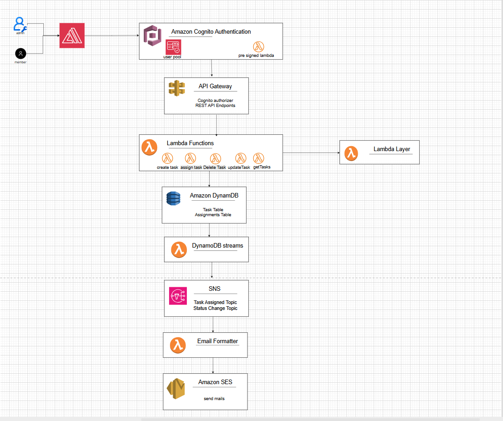

# Serverless Task Management System

Serverless task management platform built on AWS with:
- Cognito authentication and role-based access control (Admin/Member)
- API Gateway + Lambda backend
- DynamoDB for tasks and assignments
- Event-driven notifications (DynamoDB Streams -> SNS -> Lambda -> SES)
- Terraform for infrastructure provisioning
- React frontend (local or Amplify-hosted)

## Architecture At A Glance

Frontend:
- React app (`frontend/`)
- Hosted on AWS Amplify (or run locally)

Backend:
- API Gateway (Cognito authorizer)
- Lambda handlers for task CRUD, assignment, and user listing
- DynamoDB tables:
  - `tasks`
  - `assignments`

Notifications:
- DynamoDB Streams trigger `stream-processor`
- `stream-processor` publishes to SNS topics:
  - task assigned
  - task status changed
  - task deleted
- `email-formatter` consumes SNS and sends email through SES

Auth and Security:
- Cognito User Pool + User Pool Client + Hosted UI domain
- PreSignUp Lambda domain restriction
- Roles/groups (`admin`, `member`)
- IAM least privilege policies
- CloudWatch Logs 


## Architecture Diagram



## Core Business Rules

- Admin can create/update/delete/assign tasks.
- Member can only view assigned tasks.
- Member can only update task status.
- Assignment supports multiple members.
- Duplicate assignments are prevented.
- Disabled/unconfirmed users cannot be assigned.
- Notifications:
  - On assignment: assigned member(s) and admin recipients
  - On status change: assigned member(s) and admins
  - On task delete: assigned member(s)

## Repository Structure

```text
.
|-- backend/
|   |-- src/
|   |   |-- handlers/
|   |   `-- utils/
|   |-- build.js
|   `-- build-layer.js
|-- frontend/
|   |-- src/
|   |   |-- components/
|   |   |-- contexts/
|   |   |-- pages/
|   |   `-- services/
|   `-- package.json
|-- terraform/
|   |-- modules/
|   |-- main.tf
|   |-- notifications.tf
|   |-- ses.tf
|   |-- variables.tf
|   |-- outputs.tf
|   `-- terraform.tfvars
|-- amplify.yml
|-- architecture.drawio
|-- docs/
|   `-- architecture-overview.png
`-- build-lambdas.sh
```

## Prerequisites

- AWS account/credentials configured (`aws configure`)
- Terraform >= 1.0
- Node.js 18+ (Node.js 20 recommended for long-term support)
- npm
- Git Bash (or equivalent shell for `build-lambdas.sh`)

## Local Frontend Run

1. Install frontend dependencies:
```bash
cd frontend
npm install
```

2. Create/update `frontend/.env` with:
```env
REACT_APP_API_ENDPOINT=<api_gateway_endpoint>
REACT_APP_USER_POOL_ID=<cognito_user_pool_id>
REACT_APP_USER_POOL_CLIENT_ID=<cognito_user_pool_client_id>
REACT_APP_AWS_REGION=eu-west-1
```

3. Run:
```bash
npm start
```

## Build Lambda Packages

From project root:
```bash
./build-lambdas.sh
```

This builds:
- function zips into `backend/dist/`
- dependencies layer zip
- pre-signup lambda zip
- copies all deployable zips into `terraform/lambda-packages/`

## Provision/Update Infrastructure

```bash
cd terraform
terraform init
terraform plan
terraform apply
```

Useful outputs:
```bash
terraform output
```

## Amplify Deployment

Amplify build config is in `amplify.yml`.

Set these Amplify environment variables:
- `REACT_APP_API_ENDPOINT`
- `REACT_APP_USER_POOL_ID`
- `REACT_APP_USER_POOL_CLIENT_ID`
- `REACT_APP_AWS_REGION`

`amplify.yml` writes them into `.env.production` during build.

For Cognito app client redirects in production, set your Amplify URL in Terraform:
```hcl
cognito_callback_urls = ["https://<your-amplify-domain>/"]
cognito_logout_urls   = ["https://<your-amplify-domain>/"]
```

## Notifications Setup Notes

- SES email is the notification channel via `email-formatter` Lambda.
- Triggered events:
  - `TASK_ASSIGNED`
  - `TASK_STATUS_CHANGED`
  - `TASK_DELETED`

## SES Important Notes

- SES sandbox requires verified recipients.
- `ProductionAccessEnabled` must be true to send to arbitrary recipients.
- `SES_FROM_EMAIL` must be a verified SES identity.
- Corporate inboxes may still quarantine messages (check Exchange/Outlook quarantine and message trace).

## Troubleshooting

No email received:
- Check CloudWatch logs:
  - `/aws/lambda/<project>-<env>-stream-processor`
  - `/aws/lambda/<project>-<env>-email-formatter`
- Confirm SES sender/recipient identity status.

Auth errors:
- Verify frontend env vars match current Terraform outputs.
- Ensure API requests include valid Cognito JWT token.

Task visibility issues:
- Verify user role/group in Cognito.
- Verify assignment records exist in `assignments` table for that user.

## Security Notes

- PreSignUp domain restriction is enforced in Cognito trigger.
- Unauthorized API access is blocked by Cognito authorizer.
- Member permissions are enforced in backend handlers.
- IAM policies are scoped for Lambda execution role.

## Recommended Next Improvements

- Move all Lambdas and layer to Node.js 20 runtime.
- Add CI checks (lint/tests/terraform validate) on pull requests.
- Add SES deliverability hardening (SPF/DMARC and, if domain access is available, domain identity + DKIM).


